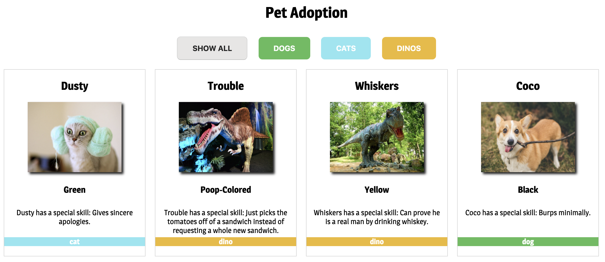
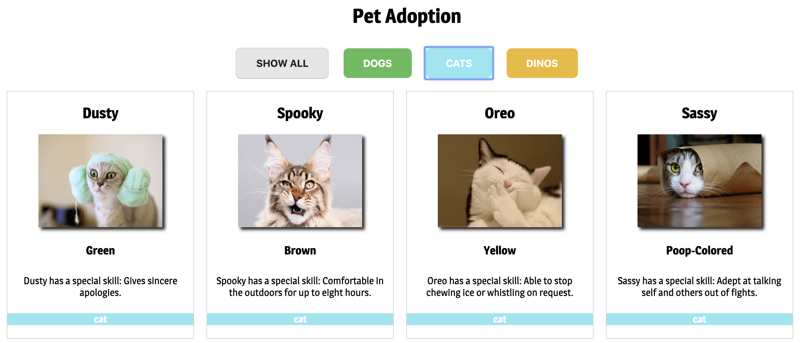
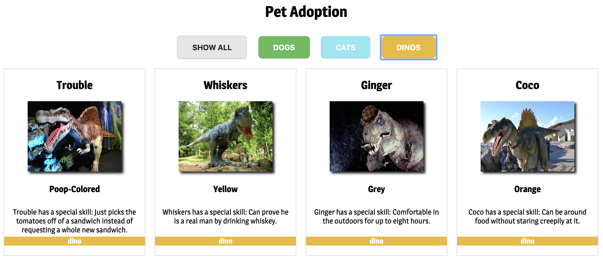

# Pet Adoption Exercise

## Description
This is a class exercise to practice using event listeners. It features product cards with animal pictures and descriptions on them, and buttons to filter for one specific animal type or to view all animals.

### Feature List
* Cards with images and descriptions printed to the DOM from an array of data using JavaScript 
* Bootstrap buttons that filter for only cats, only dogs, only dinos, or all animals based on which button is clicked

### How To Run
1. Clone the repo to have it on your local machine
1. Use `hs` to start up a local server
1. Visit the server in your browser (defaults to localhost:8080)

### Screenshots

### Contributors
* [Jeanine Beckle](https://github.com/jeaninebeckle)
